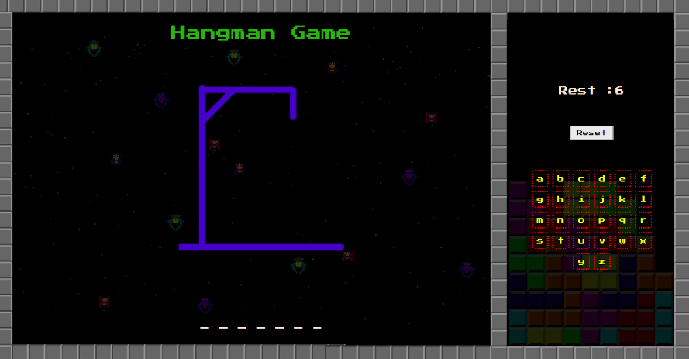
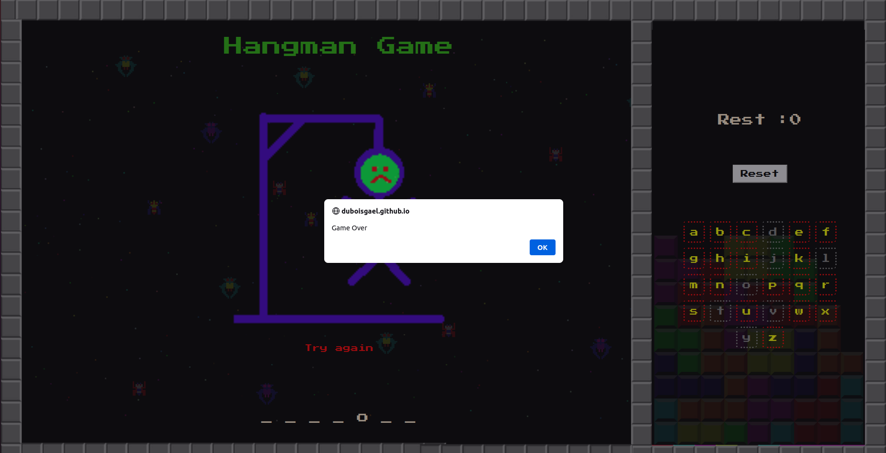

# Hangman

## Project instructions

[https://github.com/becodeorg/CRL-Keller-3.31/blob/master/LearningPath/02.The-Hill/08.Javascript/challenges/hangman.md]

## About

* Propose an hidden word
* Allow the selection of letters
* Verify if a selected letter belongs to the word
* Count the number of failure (lives)
* Check if it's a game over
* check if the word as been found

## Screenshot

 | 

## See the project

You can view my project here [https://github.com/DuboisGael/Hangman](https://duboisgael.github.io/Hangman/)

## Librairie / Toolkit
* [Fontawesome](https://fontawesome.com/) - Kit d'icône
* [Google Fonts](https://fonts.google.com/) - Fonts

## Auteurs
* **Gael Dubois**(https://github.com/DuboisGael)
